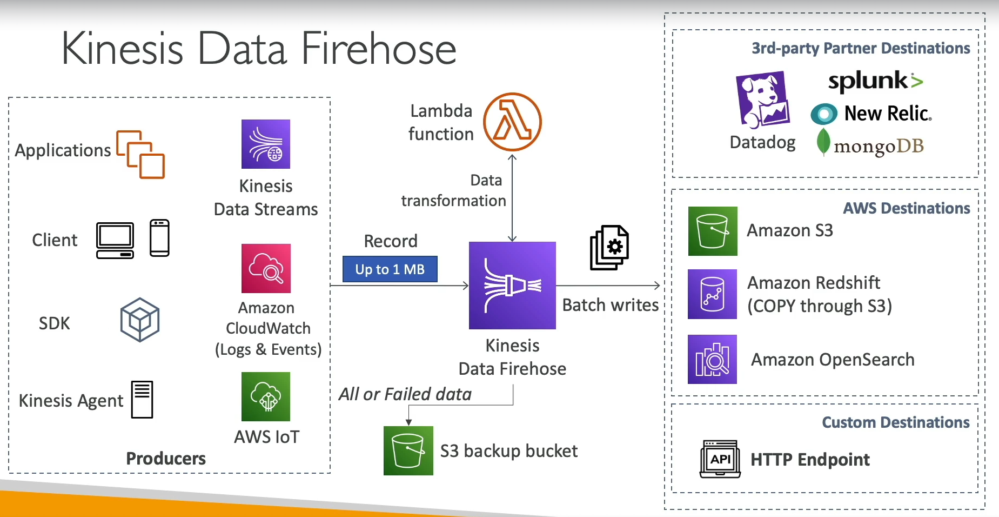

# Kinesis Data Firehose Overview

Amazon Kinesis Data Firehose is a fully managed service that automatically scales to match the throughput of your data and requires no ongoing administration. It is a serverless service that enables you to effortlessly load streaming data into data lakes, data stores, and analytics services.

## Key Features

### Fully Managed and Serverless

- **No Administration**: Automatically handles scaling, provisioning, and the management of the infrastructure.
- **Automatic Scaling**: Dynamically scales to accommodate the volume of incoming data streams.

### Destinations

Kinesis Data Firehose supports loading data into various AWS services and third-party partner destinations:

- **AWS Services**: Amazon Redshift, Amazon S3, Amazon OpenSearch Service.
- **Third-Party Partners**: Splunk, MongoDB, DataDog, NewRelic, and more.
- **Custom HTTP Endpoints**: Allows sending data to any HTTP endpoint, enabling integration with custom applications or services.

### Cost

- **Pay for What You Use**: Charges are based on the amount of data ingested into the service.

### Near Real-Time Processing

- **Buffer Interval**: Configurable from 0 seconds (no buffering) to 900 seconds, allowing for flexible data delivery intervals.
- **Buffer Size**: Minimum buffer size of 1MB, ensuring efficient data delivery.

### Data Formats and Transformations

- **Support for Multiple Data Formats**: Handles various data formats and provides options for conversion, transformation, and compression.
- **Custom Data Transformations**: Utilize AWS Lambda for bespoke data processing and transformations.

### Reliability and Backup

- **Backup to S3**: Optionally configure Kinesis Data Firehose to send failed or all data to a designated Amazon S3 bucket for backup and further analysis.

By leveraging these features, Kinesis Data Firehose provides a robust and flexible solution for streaming data ingestion and processing, making it easier for businesses to analyze their data in near real-time.

