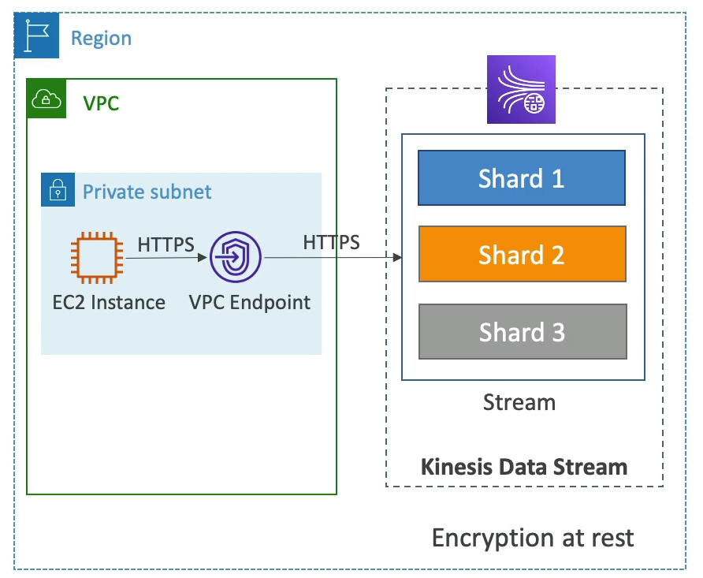

# Kinesis Data Streams - Security

Amazon Kinesis Data Streams incorporates multiple layers of security to ensure the protection and integrity of data. Here are the key security features:

## IAM Policies for Access Control

- **IAM Policies**: Control who can access your Kinesis Data Streams. Define permissions to allow or deny actions on the streams.

## Encryption in Transit

- **HTTPS Endpoints**: Data is encrypted in transit using HTTPS endpoints, ensuring secure data transfer.

## Encryption at Rest

- **KMS Integration**: Utilize AWS Key Management Service (KMS) for encryption at rest. This allows you to manage keys used for encrypting your data.

## Client-Side Encryption

- **Custom Encryption**: Implement encryption and decryption of data on the client side for additional security. This approach requires more effort but offers greater control over encryption mechanisms.

## VPC Endpoints

- **VPC Integration**: Use VPC endpoints to securely access Kinesis Data Streams within your Virtual Private Cloud (VPC), without using public internet.

## Monitoring with CloudTrail

- **CloudTrail Logs**: Monitor API calls to your Kinesis Data Streams with AWS CloudTrail. This helps in auditing and tracking access and usage.

By leveraging these security features, you can ensure that your Kinesis Data Streams are secure and compliant with your organization's security policies.

