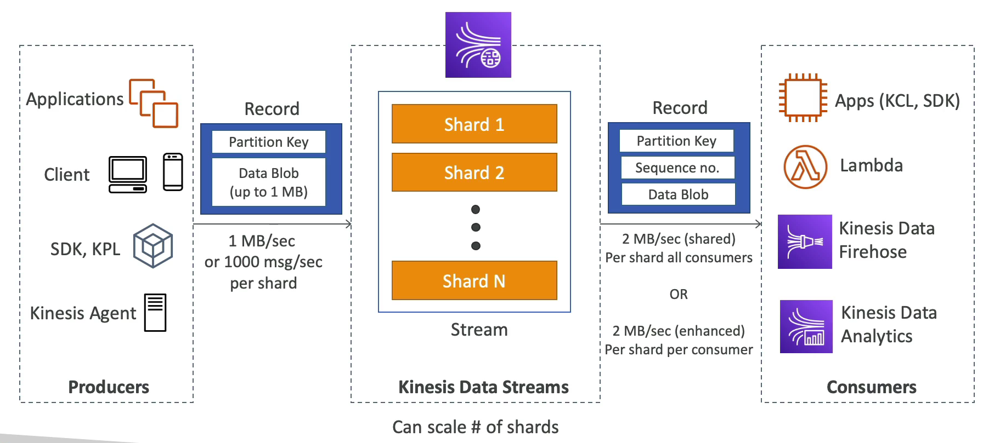

# Kinesis Data Streams

Amazon Kinesis Data Streams is a scalable and durable real-time data streaming service that can continuously capture gigabytes of data per second from hundreds of thousands of sources. Here are some of its key features:

## Data Retention

- **Duration**: Data records are stored in your stream for a default of 24 hours, which can be extended up to 365 days. This allows you to reprocess or replay your data within this retention period.

## Data Reprocessing (Replay)

- **Replayability**: Kinesis Data Streams supports the ability to reprocess or replay data. This is particularly useful for recovering from processing failures or for testing new application versions with real production data.

## Immutability

- **No Deletion**: Once data is inserted into Kinesis Data Streams, it cannot be deleted. This immutability ensures the durability and reliability of the data stream.

## Data Ordering and Sharding

- **Ordering**: Data records that share the same partition key are grouped together in the same shard. This ensures that the order of data is preserved within each shard.
- **Sharding**: A stream is composed of one or more shards. Each shard has a sequence of data records. The number of shards can be adjusted dynamically to accommodate changes in data throughput.

## Producers

- **AWS SDK**: Allows you to easily integrate your applications with Kinesis Data Streams.
- **Kinesis Producer Library (KPL)**: Provides a higher level of abstraction for producing data into Kinesis Streams. It offers efficient and reliable record batching, compression, and retry logic.
- **Kinesis Agent**: A standalone Java software application that offers an easy way to collect and send data to Kinesis Data Streams.

## Consumers

### Write Your Own

- **Kinesis Client Library (KCL)**: Provides a client-side library to build applications that process data from Kinesis Data Streams.
- **AWS SDK**: Directly interact with Kinesis Data Streams using the AWS SDK.

### Managed

- **AWS Lambda**: Automatically process data in your Kinesis stream with Lambda functions.
- **Kinesis Data Firehose**: Load streaming data into AWS data stores like Amazon S3, Amazon Redshift, or Amazon Elasticsearch Service.
- **Kinesis Data Analytics**: Analyze streaming data with SQL or Apache Flink without having to manage any infrastructure.

