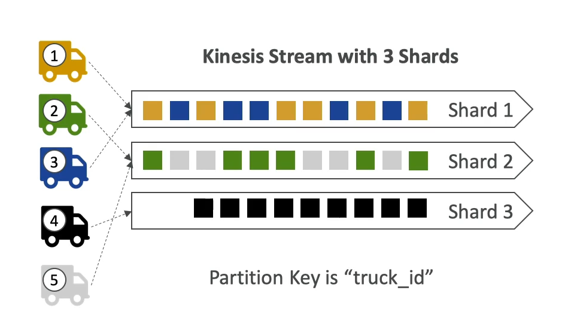
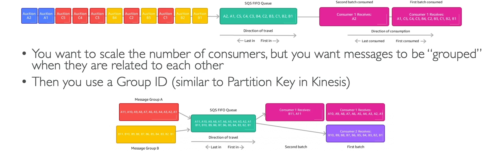

# Kinesis vs SQS Ordering

When comparing Amazon Kinesis Data Streams and Amazon SQS (Simple Queue Service) FIFO (First-In-First-Out) queues, especially in the context of handling data from 100 trucks, there are distinct differences in how data ordering and parallel processing are managed.

## Kinesis Data Streams

With Kinesis Data Streams, data is partitioned across shards, which affects how data is ordered and processed.

- **Shard Distribution**: Assuming 100 trucks and 5 shards, on average, each shard will handle data from 20 trucks.
- **Data Ordering**: Within each shard, data is strictly ordered. This means that data from the same truck (if directed to the same shard) will be processed in the order it was sent.
- **Parallel Consumers**: The maximum number of consumers processing data in parallel is limited to the number of shards, which is 5 in this scenario. This limits scalability to some extent.
- **Data Throughput**: Kinesis Data Streams can handle up to 5 MB/s of data input per shard. With 5 shards, this scales up to 25 MB/s.

## SQS FIFO

SQS FIFO queues provide a different approach, focusing on message ordering and deduplication across the entire queue.

- **Single Queue**: Only one SQS FIFO queue is used to handle all messages from the 100 trucks.
- **Group ID**: By utilizing 100 different Group IDs (one for each truck), SQS FIFO can maintain the order of messages within each group. This effectively allows for parallel processing of messages from different trucks.
- **Parallel Consumers**: Up to 100 consumers can process messages in parallel, assuming each consumer processes messages from a unique Group ID. This offers a higher degree of scalability compared to Kinesis.
- **Message Throughput**: SQS FIFO queues support up to 300 messages per second without batching and up to 3000 messages per second with batching.

## Conclusion

- **Ordering**: Both services ensure ordered processing of data. Kinesis maintains order within shards, while SQS FIFO maintains order within each Group ID.
- **Scalability**: SQS FIFO potentially allows for more parallel processing due to the ability to use up to 100 Group IDs, compared to Kinesis's limit based on the number of shards.
- **Throughput**: Kinesis may offer higher data throughput capabilities, especially if the data volume from the trucks is high.

Choosing between Kinesis Data Streams and SQS FIFO depends on the specific requirements for data ordering, throughput, and the level of parallel processing needed.

