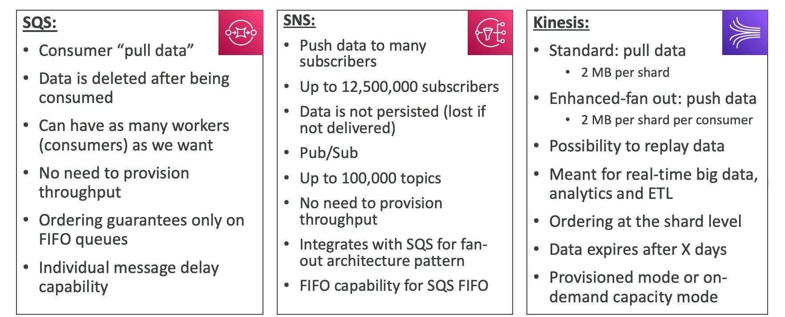

# Amazon SQS vs SNS vs Kinesis

When comparing Amazon SQS (Simple Queue Service) and Amazon SNS (Simple Notification Service), it is important to understand the differences in their use cases, message delivery, and message processing capabilities.