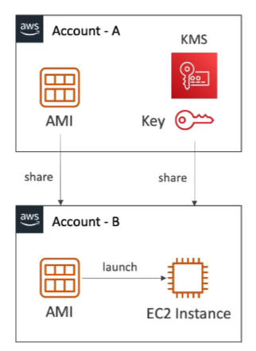

# AMI Sharing Process Encrypted

## Steps

1. **AMI Encryption**: AMI in Source Account is encrypted with KMS Key from Source Account.
2. **Modify Image Attribute**: Add a Launch Permission which corresponds to the specified target AWS account.
3. **Share KMS Keys**: Share the KMS Keys used to encrypt the snapshot the AMI references with the target account/IAM Role.
4. **Permissions in Target Account**: The IAM Role/User in the target account must have the permissions to `DescribeKey`, `ReEncrypt`, `CreateGrant`, `Decrypt`.
5. **Launch EC2 Instance**: When launching an EC2 instance from the AMI, optionally the target account can specify a new KMS key in its own account to re-encrypt the volumes.

