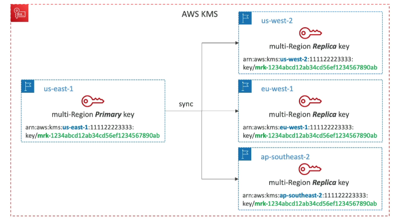
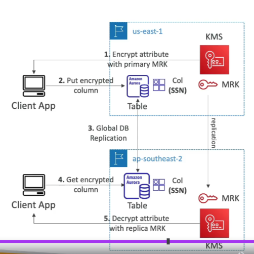

# KMS Multi-Region Keys

## Overview

- **Identical Keys**: Identical KMS keys in different AWS Regions that can be used interchangeably.
- **Key Properties**: Multi-Region keys have the same Key ID, key material, automatic rotation, etc.
- **Cross-Region Usage**: Encrypt in one Region and decrypt in other Regions without re-encryption or cross-Region API calls.
- **Management**: KMS Multi-Region keys are NOT global (Primary + Replicas). Each Multi-Region key is managed independently.

## Use Cases

- **Global Client-Side Encryption**
- **Encryption on Global DynamoDB**
- **Global Aurora**

## Global Aurora and DynamoDB Global Tables with KMS Multi-Region Keys

### Client-Side Encryption

- **Aurora Tables**: Encrypt specific attributes client-side using the AWS Encryption SDK.
- **Replication**: Combined with Aurora Global Tables, the client-side encrypted data is replicated to other regions.
- **Multi-Region Key**: If using a multi-region key replicated in the same region as the Global Aurora DB, clients in these regions can use low-latency API calls to KMS in their region to decrypt the data client-side.
- **Field Protection**: Using client-side encryption, specific fields can be protected and only decrypted if the client has access to an API key, protecting specific fields even from database admins.

