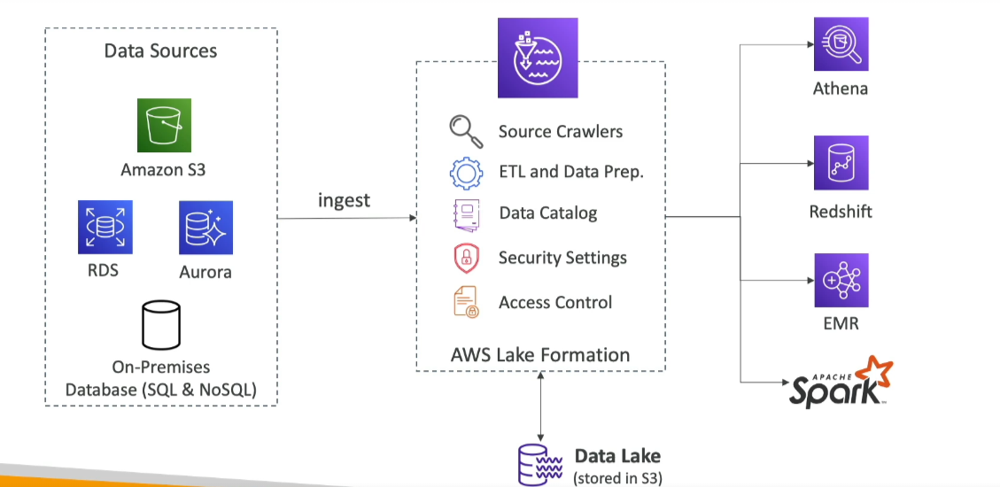

# Lake Formation

Amazon Lake Formation is a fully managed service that makes it easy to set up a data lake in days. A data lake is a central place to have all your data for analytics purposes.

## Key Features

- **Data Lake**: Central place to have all your data for analytics purposes.
- **Fully Managed**: Makes it easy to set up a data lake in days.
- **Data Operations**:
    - Discover, cleanse, transform, and ingest data into your data lake.
    - Automates many complex manual steps (collecting, cleansing, moving, cataloging data, etc.) and de-duplicates using ML Transform.
- **Data Integration**:
    - Combine structured and unstructured data in the data lake.
    - Out-of-box source blueprints: S3, RDS, Relational & NoSQL databases.
- **Access Control**: Fine-grained access control for your applications (row and column-level).
- **Built on AWS Glue**: Leverages AWS Glue for data processing and transformation.

By leveraging these features, Amazon Lake Formation simplifies the process of setting up and managing a data lake, enabling efficient and scalable data workflows.

