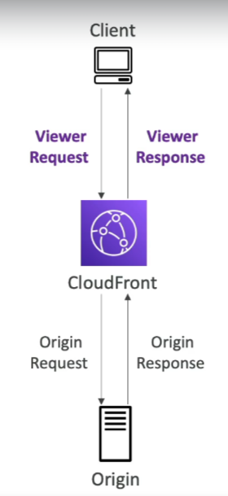

# CloudFront Functions

CloudFront Functions offer a lightweight solution for writing JavaScript functions that enable high-scale, latency-sensitive customizations for Amazon CloudFront distributions. These functions are designed to execute with sub-millisecond startup times and can handle millions of requests per second.

## Key Features

- **Lightweight JavaScript Functions**: Specifically designed for quick execution and high efficiency, allowing for rapid content delivery optimizations.
- **High-Scale Performance**: Capable of handling millions of requests per second, making it suitable for applications requiring high throughput.
- **Low Latency**: Functions execute in less than a millisecond, minimizing the impact on content delivery times.
- **Customization Points**:
    - **Viewer Request**: Functions can modify the request after CloudFront receives it from a viewer but before it checks the cache.
    - **Viewer Response**: Functions can modify the response before CloudFront forwards it to the viewer, after it fetches the response from the cache or origin.

## Use Cases

- **Request and Response Manipulation**: Modify HTTP headers, query strings, and URL paths in viewer requests and responses.
- **Content Customization**: Dynamically alter content delivery based on viewer characteristics, such as device type, geographic location, or cookies.
- **Security Enhancements**: Implement custom authentication and authorization logic, or add security headers to responses.

CloudFront Functions are a native feature of Amazon CloudFront, allowing developers to manage code entirely within the CloudFront environment for seamless integration and deployment.

