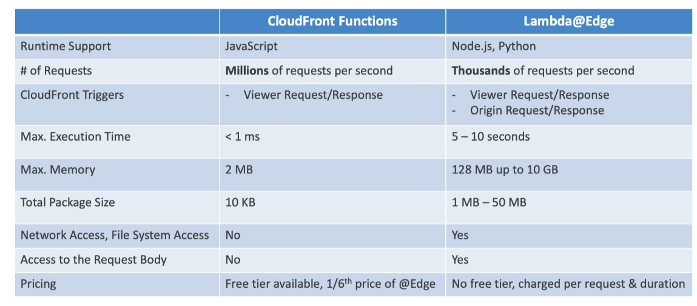

# CloudFront Functions vs Lambda@Edge - Use Cases

## CloudFront Functions

CloudFront Functions are designed for simple, lightweight tasks that require very low latency. They are executed at the edge locations, allowing for high-scale, latency-sensitive customizations.

### Use Cases

- **Cache Key Normalization**: Transform request attributes (headers, cookies, query strings, URL) to create an optimal cache key for better cache hit rates.
- **Header Manipulation**: Insert, modify, or delete HTTP headers in the request or response to control cache behavior or customize content delivery.
- **URL Rewrites or Redirects**: Change the URL path in requests to redirect users or rewrite URLs for backend processing without changing the browser URL.
- **Request Authentication & Authorization**: Create and validate user-generated tokens (e.g., JWT) to allow or deny requests, ensuring secure access to content.

## Lambda@Edge

Lambda@Edge offers more computational power and flexibility than CloudFront Functions, supporting longer execution times and access to AWS resources. It's suitable for more complex applications that require external network calls or file system access.

### Use Cases

- **Longer Execution Time**: Suitable for tasks that require several milliseconds to complete, providing more time for data processing and manipulation.
- **Adjustable CPU or Memory**: Customize the computing resources available to your function, allowing for more intensive computation tasks.
- **Third-Party Libraries**: Use external libraries (e.g., AWS SDK) to access other AWS services, enabling more complex integrations and functionalities.
- **Network Access**: Make calls to external services for additional processing or data retrieval, expanding the capabilities of your content delivery.
- **File System Access or Access to the Body of HTTP Requests**: Manipulate files or the body of requests/responses for dynamic content generation or processing.

