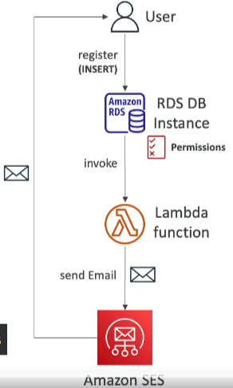

# Invoking Lambda from RDS & Aurora

Integrating AWS Lambda with Amazon RDS for PostgreSQL and Aurora MySQL enables automated data processing directly from within your database. This setup allows for real-time data manipulation and event-driven processing, enhancing the capabilities of your database applications.

## Key Features

- **Direct Invocation**: Lambda functions can be invoked directly from triggers or stored procedures within your RDS for PostgreSQL or Aurora MySQL databases.
- **Data Event Processing**: Automate the processing of data events, such as inserts, updates, or deletes, by triggering Lambda functions in response to database events.
- **Supported Databases**: Currently, this feature is available for Amazon RDS for PostgreSQL and Aurora MySQL instances.

## Configuration Requirements

### Network Configuration

- **Outbound Traffic**: Ensure that your database instance can send outbound traffic to your Lambda function. This may require configuring a Public IP, NAT Gateway, or VPC Endpoints, depending on your network setup.

### Permissions

- **Lambda Resource-based Policy**: Update the Lambda function's resource-based policy to allow invocations from your database instance.
- **IAM Policy**: The database instance must have an associated IAM role with permissions to invoke the Lambda function. This role is specified in the database's configuration.

## Implementation Steps

1. **Lambda Function Setup**: Create and configure your Lambda function with the necessary logic for processing database events.
2. **Database Configuration**: Enable outbound network access from your database instance to the Lambda function.
3. **Permission Assignment**: Update the Lambda function's resource-based policy and attach the necessary IAM role to your database instance.
4. **Trigger Setup**: Define triggers or stored procedures in your database that will invoke the Lambda function based on specific data events.

By following these steps, you can seamlessly integrate AWS Lambda with your RDS for PostgreSQL or Aurora MySQL databases, enabling sophisticated, real-time data processing capabilities within your database environment.

