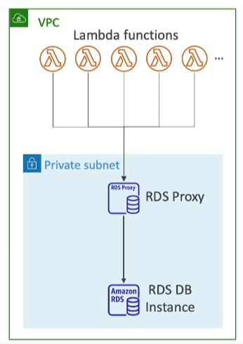

# Lambda with RDS Proxy

When AWS Lambda functions access databases directly, they can open too many connections, especially under high load. This can lead to scalability issues and potentially exhaust database resources. AWS RDS Proxy addresses these challenges by offering a more scalable, available, and secure database access mechanism.

## RDS Proxy Benefits

- **Improved Scalability**: By pooling and sharing database connections, RDS Proxy significantly reduces the number of connections to the database, enhancing scalability.
- **Enhanced Availability**: RDS Proxy reduces database failover times by up to 66%, maintaining connections during the failover process to ensure higher availability.
- **Increased Security**: Enforces IAM authentication for database access and allows for credentials to be securely stored in AWS Secrets Manager, improving the security posture.

## Integration with Lambda

To leverage RDS Proxy, your Lambda function must be deployed within your AWS Virtual Private Cloud (VPC), as RDS Proxy is not accessible publicly. This setup ensures that your Lambda function can securely access the RDS Proxy, which then manages connections to the database.

### Configuration Steps

1. **Deploy Lambda in VPC**: Ensure your Lambda function is configured to run in your VPC, enabling it to access internal AWS resources.
2. **Configure RDS Proxy**: Set up an RDS Proxy instance in your VPC, specifying the target database and connection pooling settings.
3. **Use IAM Authentication**: Configure your Lambda function to use IAM roles for database authentication, leveraging AWS Secrets Manager for credential storage.
4. **Connect to RDS Proxy**: Modify your Lambda function's database connection logic to connect through the RDS Proxy endpoint instead of directly to the database.

By following these steps, you can enhance the scalability, availability, and security of your Lambda functions when accessing databases, making your applications more resilient and efficient.

