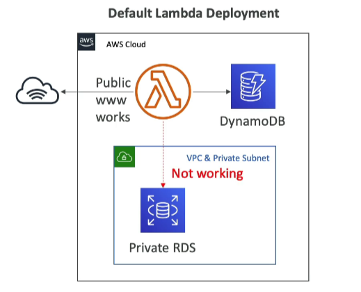
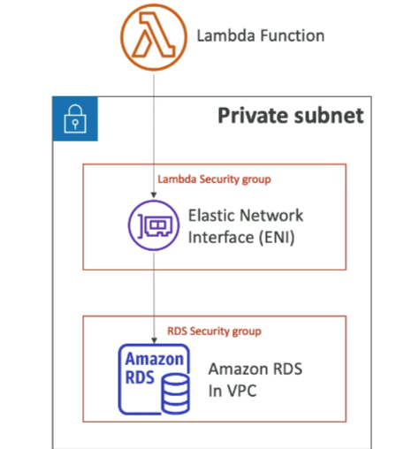

# Lambda Networking Overview

AWS Lambda functions provide flexible compute options for running your code in response to events. Understanding the networking behavior of Lambda functions is crucial for architecting applications that interact with other AWS services or resources within a Virtual Private Cloud (VPC).

## Lambda by Default

By default, when a Lambda function is created, it operates within an AWS-owned VPC. This default setup allows the function to interact with the internet and AWS services that are publicly accessible. However, it does not have access to:

- Resources within your own VPC, such as Amazon RDS instances, ElastiCache clusters, or internal Elastic Load Balancers (ELB).

## Lambda in VPC

To enable a Lambda function to access resources within your VPC, you must configure it to connect to your VPC. This involves specifying:

- **VPC ID**: The identifier of your VPC where the resources reside.
- **Subnets**: One or more subnet IDs within your VPC where the Lambda function should operate. These subnets determine the IP range and availability zone(s) that the function can access.
- **Security Groups**: One or more security group IDs that define the networking access rules for the Lambda function within your VPC.

### Elastic Network Interface (ENI)

- When configured to run in a VPC, Lambda functions use an Elastic Network Interface (ENI) to interact with resources within the VPC.
- An ENI is automatically created in the specified subnets, allowing the Lambda function to communicate under the security rules defined by the associated security groups.

Configuring Lambda to run in a VPC enables secure and private interaction with your VPC resources but may introduce additional latency if the function needs to access the internet or AWS services outside the VPC. To mitigate this, consider using VPC endpoints or a NAT gateway for outbound internet access.