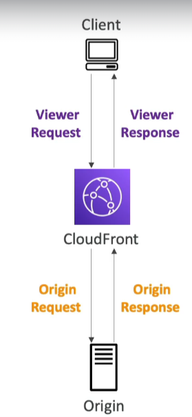

# Lambda@Edge

Lambda@Edge allows you to run Lambda functions to customize the content that Amazon CloudFront delivers, executing your code in response to CloudFront events. These functions can be written in Node.js or Python and are designed to scale automatically to thousands of requests per second.

## Key Features

- **Language Support**: Supports functions written in Node.js and Python, offering flexibility in how you implement your custom logic.
- **Scalability**: Automatically scales to handle thousands of requests per second, ensuring high performance for your content delivery.
- **Global Deployment**: Author your functions in the AWS Region (us-east-1), and CloudFront automatically replicates them to locations worldwide, reducing latency.

## CloudFront Events for Customization

- **Viewer Request**: Execute functions after CloudFront receives a request from a viewer and before it checks the cache.
- **Origin Request**: Execute functions before CloudFront forwards the request to the origin server, allowing you to customize requests to the origin.
- **Origin Response**: Execute functions after CloudFront receives the response from the origin server and before it caches the response.
- **Viewer Response**: Execute functions before CloudFront forwards the response to the viewer, enabling you to customize the response sent to viewers.

## Use Cases

- **Content Customization**: Dynamically modify requests and responses based on viewer location, device type, or cookies.
- **SEO Enhancements**: Manipulate URLs or redirect requests to improve search engine optimization.
- **Security and Access Control**: Implement custom authentication and authorization logic to control access to your content.

Lambda@Edge integrates seamlessly with AWS CloudFront, enhancing your ability to deliver customized, scalable, and secure web content.

