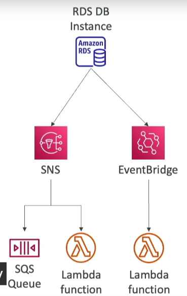

# RDS Event Notifications

Amazon RDS provides event notifications that inform you about changes to your DB instances, snapshots, parameter groups, security groups, RDS Proxies, and custom engine versions. These notifications do not include information about the data within the databases but rather about the operational aspects of the database instances themselves.

## Key Features

- **Event Categories**: Subscribe to notifications for specific event categories such as:
    - **DB Instance**: Notifications about the DB instance lifecycle events (e.g., creation, stop, start).
    - **DB Snapshot**: Events related to the creation, deletion, or restoration of DB snapshots.
    - **DB Parameter Group**: Notifications about changes to DB parameter groups.
    - **DB Security Group**: Alerts on modifications to DB security groups.
    - **RDS Proxy**: Notifications concerning RDS Proxy operations.
    - **Custom Engine Version**: Events related to custom engine versions.

- **Near Real-Time Notifications**: Events are delivered in near real-time, typically within five minutes of the event occurrence.

## Notification Methods

- **Amazon SNS**: Configure Amazon Simple Notification Service (SNS) to receive notifications via email, SMS, or other SNS-supported communication channels.
- **Amazon EventBridge**: Subscribe to RDS events using Amazon EventBridge for more advanced event handling and integration with AWS services or custom applications.

## Configuration Steps

1. **Choose the Event Categories**: Select the RDS event categories you are interested in monitoring.
2. **Set up Notification Method**:
    - For SNS: Create an SNS topic and subscribe to it using your preferred notification channel (e.g., email).
    - For EventBridge: Create an EventBridge rule that matches the RDS event pattern and configure the target (e.g., Lambda function, SNS topic) to handle the event.
3. **Subscribe to Notifications**: Use the AWS Management Console, AWS CLI, or RDS API to subscribe to the selected event categories with your chosen notification method.

By configuring RDS event notifications, you can stay informed about the operational status and changes to your RDS resources, enabling proactive management and response to events.

 
