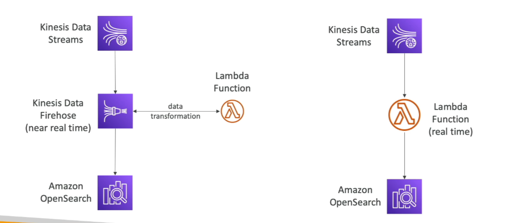

# OpenSearch Service

Amazon OpenSearch Service is the successor to Elasticsearch, providing powerful search and analytics capabilities. It is commonly used as a complement to other databases, enabling advanced search functionalities that go beyond the primary key or index-based queries of databases like DynamoDB.

## Key Features

- **Flexible Search**: Unlike DynamoDB, which only supports queries by primary key or indexes, OpenSearch allows you to search any field, including partial matches.
- **Complementary Use**: Often used alongside other databases to enhance search capabilities.

## Deployment Modes

- **Managed Cluster**: A fully managed OpenSearch cluster provided by AWS.
- **Serverless Cluster**: A serverless option for OpenSearch, simplifying deployment and scaling.

## SQL Support

- **Non-native SQL Support**: OpenSearch does not natively support SQL, but this functionality can be enabled via a plugin.

## Data Ingestion

- **Kinesis Data Firehose**: Stream data from Kinesis Data Firehose into OpenSearch.
- **AWS IoT**: Ingest data from AWS IoT.
- **CloudWatch Logs**: Import logs from CloudWatch Logs for analysis.

## Security

- **Authentication**: Secure access through Amazon Cognito and IAM.
- **Encryption**: Data encryption using AWS Key Management Service (KMS) and TLS.

## Visualization

- **OpenSearch Dashboards**: Provides visualization tools for your data, similar to Kibana.

By leveraging these features, Amazon OpenSearch Service can significantly enhance the search and analytics capabilities of your applications.

