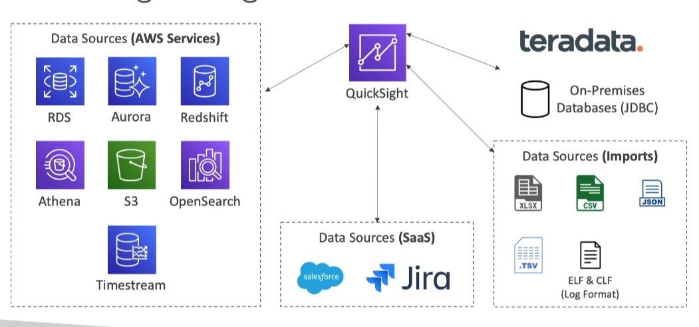

# QuickSight

Amazon QuickSight is a serverless, machine learning-powered business intelligence service that allows you to create interactive dashboards. It is designed to be fast, automatically scalable, and embeddable, with a pricing model based on per-session usage.

## Key Features

- **Serverless**: No infrastructure to manage, automatically scales with usage.
- **Machine Learning-Powered**: Leverages machine learning to provide insights and analytics.
- **Interactive Dashboards**: Create and share interactive dashboards with ease.
- **Embeddable**: Can be embedded into applications for seamless integration.
- **Per-Session Pricing**: Cost-effective pricing model based on usage.

## Use Cases

- **Business Analytics**: Analyze business data to make informed decisions.
- **Building Visualizations**: Create visual representations of data for better understanding.
- **Perform Ad-Hoc Analysis**: Conduct on-the-fly analysis without the need for pre-defined reports.
- **Get Business Insights Using Data**: Extract actionable insights from your data.

## Data Integration

QuickSight integrates with various AWS data sources, including:

- **RDS**: Amazon Relational Database Service
- **Aurora**: Amazon Aurora
- **Athena**: Amazon Athena
- **Redshift**: Amazon Redshift
- **S3**: Amazon Simple Storage Service

## In-Memory Computation

- **SPICE Engine**: QuickSight uses the Super-fast, Parallel, In-memory Calculation Engine (SPICE) for in-memory computation when data is imported into QuickSight, providing fast and responsive analytics.

## Enterprise Edition

- **Column-Level Security (CLS)**: The Enterprise edition of QuickSight offers the ability to set up Column-Level Security, allowing for more granular control over data access.

By leveraging these features, Amazon QuickSight enables organizations to gain valuable insights from their data, supporting better decision-making and business outcomes.

