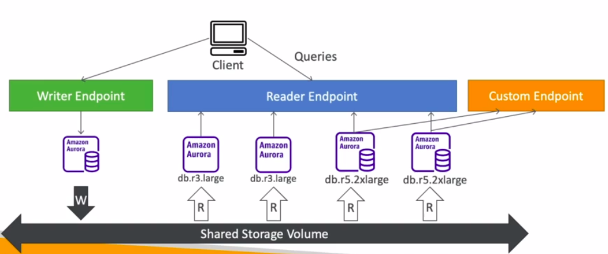

# Aurora - Custom Endpoint

- Define a subset of Aurora Instances as a Custom Endpoint
- Example: Run analytical queries on specific replicas
- The Reader Endpoint is generally not used after defining Custom Endpoints

