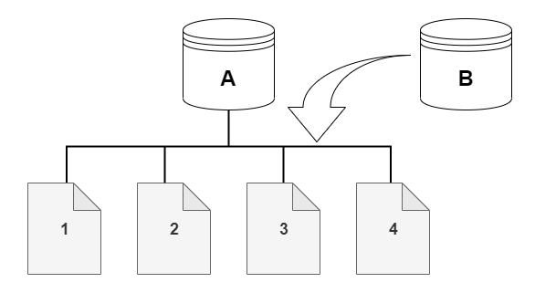

# Aurora Database Cloning

Aurora Database Cloning allows for the creation of a new Aurora DB Cluster from an existing one. This method is faster and more efficient than traditional snapshot and restore methods, thanks to the use of a copy-on-write protocol.

## How it Works

- **Initial State**: The new DB cluster initially shares the same data volume as the original DB cluster. This approach is fast and efficient because no data copying is needed at this stage.
- **After Updates**: When changes are made to the data in the new DB cluster, additional storage is allocated for these changes, and the data is copied to this separate storage space. This ensures that the original data remains unaffected.

## Benefits

- **Speed**: Cloning is very fast since it avoids the time-consuming data copy process initially.
- **Cost-Effectiveness**: It is cost-effective because additional storage is only used when changes are made, and it leverages the existing data without needing to duplicate it upfront.
- **Use Cases**: Particularly useful for creating a staging database from a production database without impacting the performance or integrity of the production environment.

