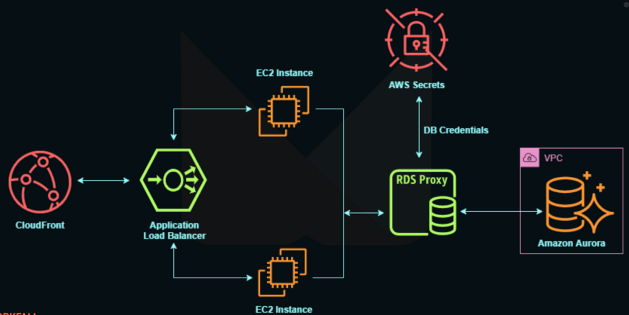

# RDS Proxy

RDS Proxy is a fully managed database proxy service designed for Amazon RDS and Aurora databases. It enables applications to pool and share database connections, significantly improving database efficiency and resource utilization.

## Key Features

- **Connection Pooling**: Allows multiple applications to share a pool of database connections, reducing the overhead of establishing new connections for each request.
- **Efficiency and Resource Optimization**: By minimizing the number of open connections and timeouts, RDS Proxy reduces the stress on database resources such as CPU and RAM.
- **Serverless and Autoscaling**: Operates in a serverless manner, automatically scaling with the application's needs. It is also highly available across multiple Availability Zones (AZs).
- **Failover Time Reduction**: Can reduce RDS and Aurora failover times by up to 66%, enhancing database availability and reliability.
- **Broad Database Support**: Compatible with RDS and Aurora databases running MySQL, PostgreSQL, MariaDB, and MS SQL Server.
- **Seamless Integration**: Most applications can use RDS Proxy without requiring any code changes.
- **Security**: Enforces IAM Authentication for database access and securely stores credentials in AWS Secrets Manager, enhancing security.
- **VPC Access**: RDS Proxy is not publicly accessible and must be accessed from within an Amazon Virtual Private Cloud (VPC), ensuring a secure environment.

RDS Proxy is an ideal solution for applications requiring high database performance and efficiency, without compromising on security and scalability.

