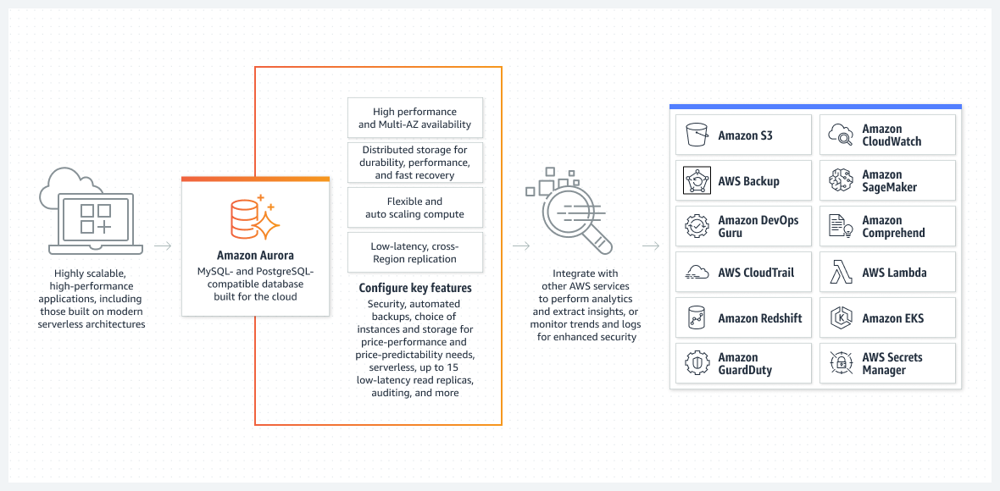

# AWS Aurora

- AWS Aurora is a proprietary technology from AWS. It's not open-sourced.

- Both Postgres and MySQL are supported as Aurora DB. This means your drivers will work as if Aurora was a Postgres or MySQL database.

- Aurora is AWS cloud-optimized and claims a 5x performance improvement over MySQL on RDS, and over 3x the performance of Postgres on RDS.

- Aurora storage automatically grows in increments of 10GB, up to 128TB.

- Aurora can have up to 15 replicas, and the replication process is faster than MySQL (sub 10 ms replica lag).

- Failover in Aurora is instantaneous. It's High Availability (HA) native.

- Aurora costs more than RDS (20% more) but is more efficient.

## Features of AWS Aurora

- **Automatic fail-over**: In the event of a failure, Aurora automatically fails over to a standby replica in another Availability Zone.

- **Backup and Recovery**: Aurora backs up your database automatically and supports point-in-time recovery.

- **Isolation and Security**: Aurora provides multiple levels of security for your database, including network isolation using Amazon VPC, encryption at rest using keys you create and control through AWS Key Management Service (KMS).

- **Industry Compliance**: Aurora is compliant with various industry standards, ensuring the safety and security of your data.

- **Push-button Scaling**: You can scale your database's compute and storage resources with only a few mouse clicks or an API call.

- **Automated Patching with Zero Downtime**: Aurora applies patches within the maintenance window you define, ensuring your databases are up-to-date with the latest patches.

