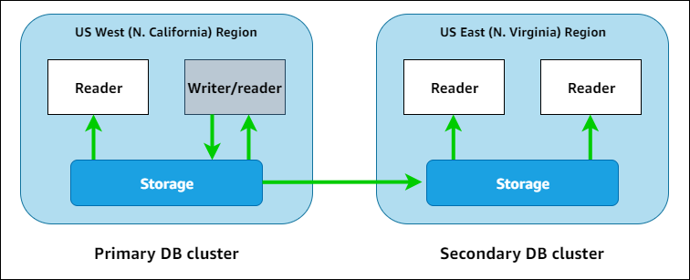

# Global Aurora

## Aurora Cross Region Read Replicas

- Useful for disaster recovery.
- Simple to put in place.

## Aurora Global Database (recommended)

- **1 Primary Region** (read/write).
- **Up to 5 secondary regions** (read-only), with replication lag of less than 1 second.
- **Up to 16 Read Replicas** per secondary region, aiding in decreasing latency.
- Promoting another region for disaster recovery has a Recovery Time Objective (RTO) of less than 1 minute.

