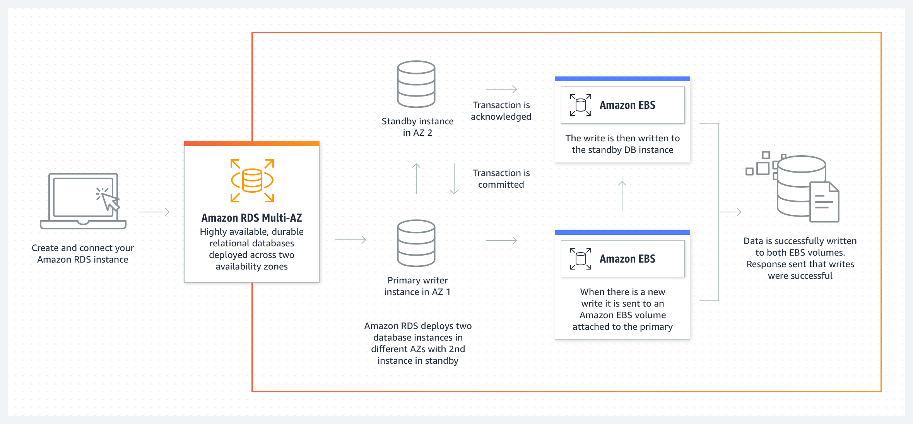

# RDS Multi-AZ (Disaster Recovery)

- RDS Multi-AZ deployments provide enhanced availability and durability for Database (DB) Instances, making them a suitable solution for production workloads.

- These deployments use synchronous replication to keep data in the standby DB instance up-to-date with the primary DB instance.

- RDS Multi-AZ deployments provide a single DNS name that automatically routes your application's database traffic to the current primary DB instance.

- This automatic routing increases availability and allows for automatic failover to the standby in case of an infrastructure failure (such as loss of an Availability Zone, loss of network, instance or storage failure).

- There is no manual intervention required in your application as the failover is handled automatically.

- Note: Multi-AZ deployments are not used for scaling. However, you can use Read Replicas, which can also be set up as Multi-AZ deployments, to offload your read traffic.

