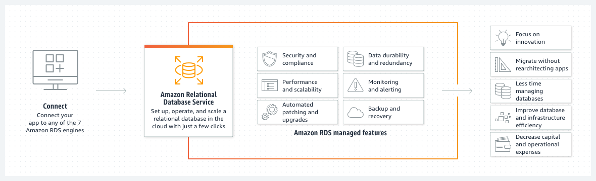

# RDS (Relational Database Service)

- RDS allows you to create databases in the cloud that are managed by AWS. It supports various database engines such as **Postgres, MySQL, MariaDB, Oracle, Microsoft SQL Server, IBM DB2, and Aurora** (AWS proprietary database).

- RDS is a managed service, providing the following features:
    - Automated provisioning and OS patching.
    - Continuous backups and restore to a specific timestamp (Point in Time Restore).
    - Monitoring dashboards.
    - Read replicas for improved read performance.
    - Multi-AZ setup for Disaster Recovery (DR).
    - Maintenance windows for upgrades.
    - Scaling capability (both vertical and horizontal).
    - Storage backed by EBS (gp2 or io1).

- Note: You can't SSH into your RDS instances.

