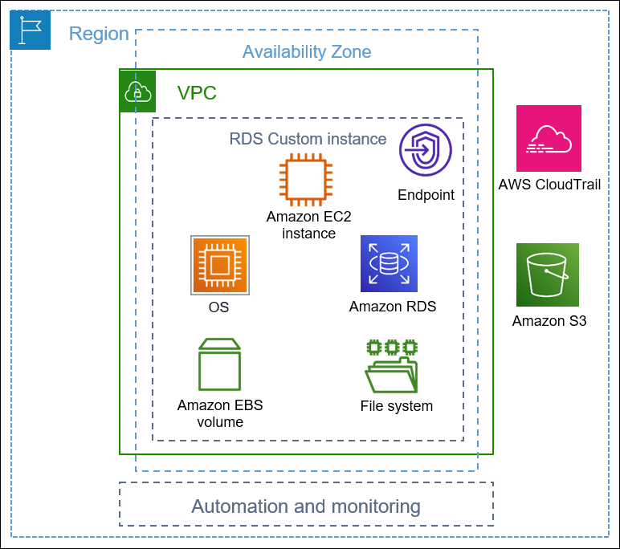

# RDS Custom

- RDS Custom provides managed Oracle and Microsoft SQL Server Databases with the ability to customize the operating system and database.

- While RDS automates the setup, operation, and scaling of a database in AWS, RDS Custom provides access to the underlying database and OS. This allows you to:
    - Configure settings
    - Install patches
    - Enable native features
    - Access the underlying EC2 Instance using SSH or SSM Session Manager

- You can de-activate Automation Mode to perform your customization. It's recommended to take a DB snapshot before doing so.

# RDS vs RDS Custom

- RDS: Provides a fully managed service where the entire database and the OS are managed by AWS. This is suitable for users who want to offload the administrative burden.

- RDS Custom: Provides full admin access to the underlying OS and the database. This is suitable for users who need more control over their database and OS configurations.

