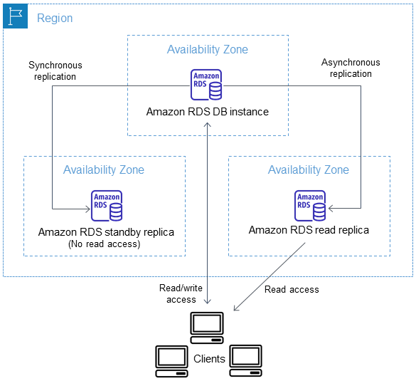

# RDS Read Replicas for Read Scalability

- RDS allows you to create up to 15 read replicas within an Availability Zone, across multiple Availability Zones, or across Regions.

- Replication is asynchronous, meaning that reads from the replicas are eventually consistent.

- Replicas can be promoted to become their own databases.

- To leverage read replicas, applications must update their connection strings accordingly.

