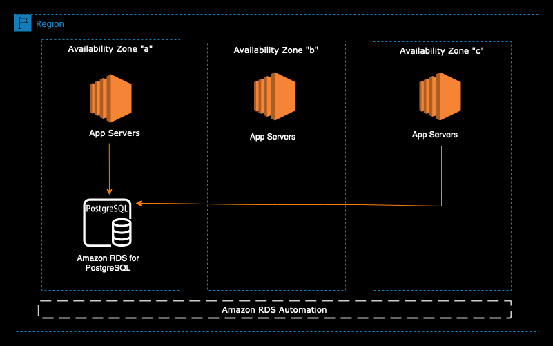

# RDS single-AZ
- RDS single-AZ deployments are suitable for development and test environments.
- They are not recommended for production workloads because they lack the high availability and durability provided by Multi-AZ deployments.
- In a single-AZ deployment, the primary DB instance runs in one Availability Zone (AZ).
- If the primary DB instance fails, you must manually promote a Read Replica to become the new primary DB instance.
- Single-AZ deployments are not used for scaling. However, you can use Read Replicas to offload your read traffic.

# Transitioning from Single-AZ to Multi-AZ in RDS

- Transitioning from a Single-AZ deployment to a Multi-AZ deployment in RDS is a zero-downtime operation, meaning there's no need to stop the database.

- To initiate the transition, simply click on 'Modify' for the database.

- Internally, the following steps occur:
    - A snapshot of the current database is taken.
    - A new database is restored from the snapshot in a new Availability Zone (AZ).
    - Synchronization is established between the two databases, ensuring that any changes made to the primary database are automatically replicated to the new database in the other AZ.

