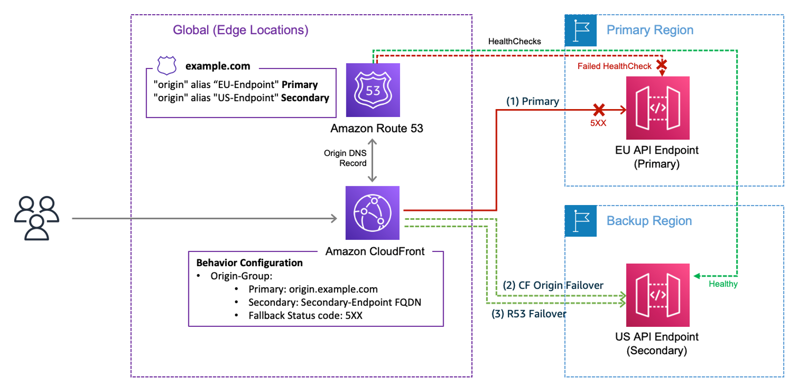

## Failover Routing Policy in Route 53

Failover routing in AWS Route 53 allows you to route traffic to a primary resource when it's healthy and to a secondary resource when the primary is unhealthy. This setup is essential for maintaining high availability and ensuring users are directed to operational resources at all times.

### Key Components

- **Primary Record**: Routes traffic to your main resource (e.g., an EC2 instance, an Amazon S3 bucket configured as a website).
- **Secondary Record**: Routes traffic to a backup resource when the primary is unhealthy. This can be another EC2 instance, a static S3 website, or any other suitable AWS resource.

### Configuration Steps

1. **Create Health Checks**: Set up health checks for both your primary and secondary resources. These checks monitor the health of your resources and determine which one should receive traffic.

2. **Configure Primary Record**:
    - Choose the `Failover` routing policy.
    - Set the record type as `Primary`.
    - Associate the health check created for the primary resource.

3. **Configure Secondary Record**:
    - Also choose the `Failover` routing policy for the secondary record.
    - Set the record type as `Secondary`.
    - Associate the health check for the secondary resource, if applicable.

4. **DNS Configuration**: Ensure your DNS settings are correctly configured to point to the Route 53 DNS servers.

### Use in Private Hosted Zones

Failover routing policies can also be applied within private hosted zones. This allows for failover configurations that are only accessible within your VPC or corporate network, enhancing internal application resilience.

### Active-Passive Failover

This setup is typically used in an active-passive failover configuration, where the secondary resource is only used if the primary becomes unavailable. It's a straightforward way to implement high availability for your applications and services.

### Considerations

- **Health Check Reliability**: Ensure your health checks accurately reflect the health of your resources to prevent unnecessary failovers.
- **Secondary Resource Readiness**: The secondary resource should be kept in a state that allows it to take over traffic immediately without additional setup or delay.

By following these guidelines, you can effectively implement a failover routing policy in AWS Route 53, ensuring your applications remain available even in the face of resource failures.

