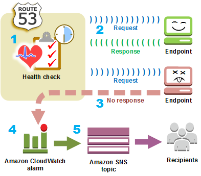

# Health Checks in Route 53

Health checks in AWS Route 53 are designed to monitor the health of your resources and are integral to implementing automated DNS failover strategies. They can be used to monitor public resources via HTTP health checks. There are three main types of health checks:

## 1. Endpoint Health Checks
- Monitor the health of an application, server, or other AWS resources directly.
- Suitable for applications and services accessible over the internet.

## 2. Calculated Health Checks
- Monitor the status of other health checks.
- Useful for aggregating the health status of multiple resources.

## 3. CloudWatch Alarm Health Checks
- Monitor AWS CloudWatch Alarms.
- Can be used for resources that do not have a direct internet-facing endpoint, such as internal databases or application metrics.
- Examples include monitoring the throttle events of DynamoDB, alarms on RDS instances, or custom metrics that you define.

Health checks are integrated with CloudWatch metrics, allowing for detailed monitoring and alerting based on the health of your resources.

