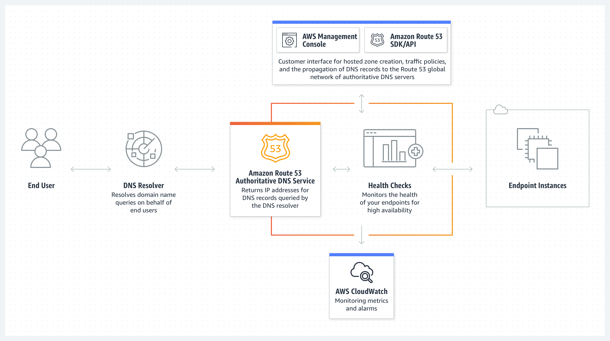

# Route 53 Overview

Amazon Route 53 is a highly available and scalable cloud Domain Name System (DNS) web service. It is designed to give developers and businesses an extremely reliable and cost-effective way to route end users to Internet applications by translating names like `www.example.com` into the numeric IP addresses like `192.0.2.1` that computers use to connect to each other. Route 53 is fully manageable and allows you to manage your DNS records.

## Key Features

- **Authoritative DNS**: Route 53 is an authoritative DNS system, meaning that you have the control to update DNS records for your domain.
- **Domain Registrar**: Apart from being a DNS service provider, Route 53 also offers domain registration services. You can purchase and manage domain names directly through Route 53.
- **Health Checks**: It can monitor the health and performance of your application and automatically route your users to healthy endpoints or to a backup site if your primary site becomes unavailable.
- **100% Availability SLA**: Route 53 is the only AWS service that offers a 100% Service Level Agreement (SLA) availability, ensuring that your DNS service is always available.

## Why "Route 53"?

The name "Route 53" is a nod to TCP or UDP port 53, where DNS server requests are addressed. This reflects the service's foundational role in managing DNS, which is essential for the internet's operation.

