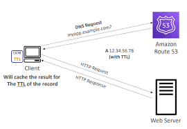

# Route 53 - Records TTL (Time to Live)

## High TTL (e.g., 24 hr)
- Less traffic on Route 53
- Possibly outdated records

## Low TTL (e.g., 60 sec)
- More traffic on Route 53 ($$)
- Records are outdated for less time
- Easy to change records

Except for Alias records, TTL is mandatory for each DNS record.

