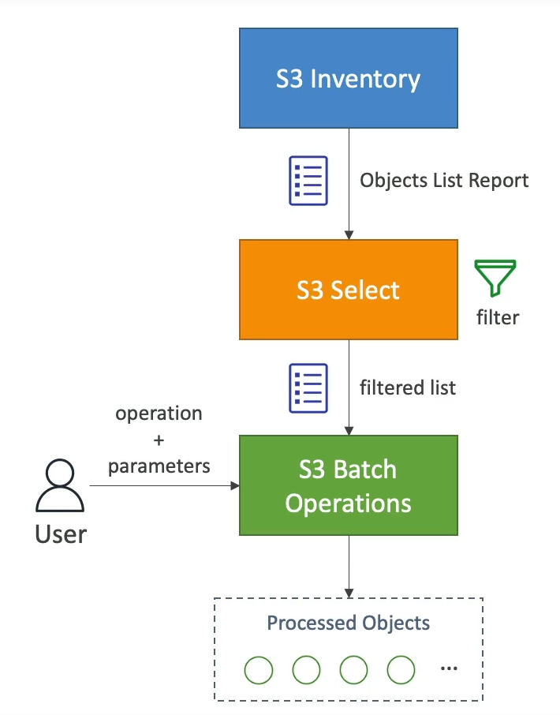

# S3 Batch Operations Overview

S3 Batch Operations is a powerful feature that allows you to perform large-scale operations across millions of objects stored in Amazon S3 with a single request. This feature simplifies managing objects at scale, whether you're modifying object metadata, copying objects between buckets, or performing other bulk actions.

## Key Features

- **Bulk Operations**: Perform actions such as modifying metadata, copying objects, encrypting objects, changing Access Control Lists (ACLs), adding tags, and restoring objects from S3 Glacier.
- **Custom Actions**: Invoke AWS Lambda functions to execute custom actions on each object as part of a batch job.
- **Efficiency and Scalability**: Manage retries, track the progress of operations, send completion notifications, and generate detailed reports, all handled by S3 Batch Operations.

## How It Works

1. **Job Creation**: A job is created by specifying a list of objects, the action to perform on those objects, and any optional parameters required for the action.
2. **Using S3 Inventory**: To generate the list of objects for a job, you can use S3 Inventory, which provides a scheduled report of all objects within a bucket.
3. **Filtering with S3 Select**: Further refine your object list by using S3 Select to filter objects based on specific criteria, such as metadata or object tags.

## Use Cases

- **Modifying Object Properties**: Update metadata or properties of objects in bulk, such as setting a new storage class or updating custom metadata fields.
- **Copying Objects**: Efficiently copy objects between S3 buckets, useful for data replication or backup strategies.
- **Data Encryption**: Apply encryption to previously unencrypted objects to enhance data security.
- **Access Control and Tagging**: Update ACLs or tags across a large number of objects to reflect changes in access policies or categorization.
- **Restoring from Glacier**: Bulk restore objects from S3 Glacier for access or analysis.
- **Custom Processing**: Leverage AWS Lambda to perform custom processing or transformations on objects as part of a batch operation.

By leveraging S3 Batch Operations, you can automate and streamline the management of your S3 objects, making it easier to handle large-scale data with efficiency and precision.

 
