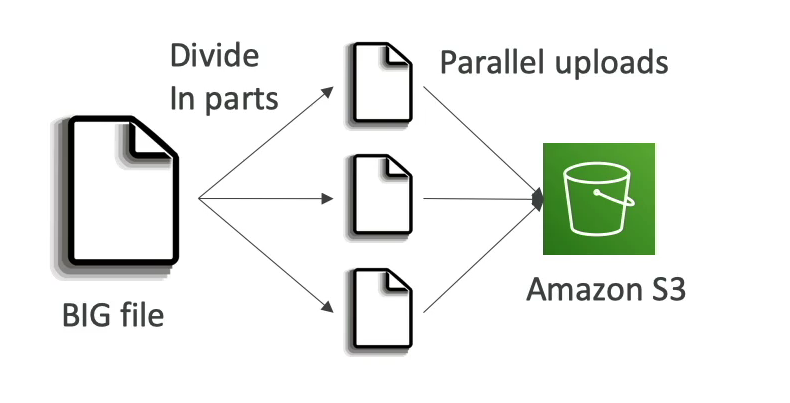
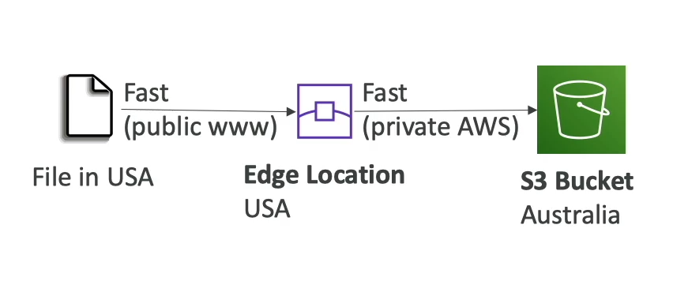
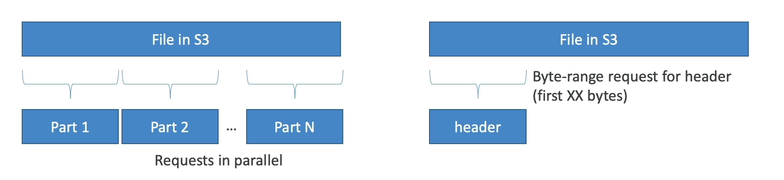

# S3 Performance Enhancements

Amazon S3 offers several features to enhance the performance of uploading and downloading data. These features are designed to optimize transfer speeds, improve resilience, and provide flexibility in how data is managed.

## Multi-Part Upload

For large files, S3's multi-part upload feature is highly recommended:

- **Recommended for Files Larger Than 100MB**: It's more efficient to use multi-part upload for files over 100MB in size.
- **Mandatory for Files Larger Than 5GB**: Files exceeding 5GB must be uploaded using the multi-part upload feature.
- **Parallel Uploads**: This feature allows for the parallelization of uploads, significantly speeding up the transfer process for large files.

## S3 Transfer Acceleration

S3 Transfer Acceleration optimizes the speed of data transfers to and from S3:

- **Faster Transfers**: By transferring files to an AWS edge location, data is then forwarded to the S3 bucket in the target region at a faster rate.
- **Compatibility**: Works in conjunction with multi-part uploads, enhancing the upload speed of large files.
- **Global Edge Network**: Utilizes Amazon's globally distributed edge locations to accelerate transfers.

## Parallelize GET Requests

Improving download speeds and resilience can be achieved by parallelizing GET requests:

- **Byte-Range Fetches**: Request specific byte ranges of a file to download data in parallel, increasing the efficiency of downloads.
- **Resilience**: This approach offers better resilience against failures, as only specific parts of the file need to be re-requested in case of an interruption.
- **Partial Data Retrieval**: Useful for applications that require only a portion of the data, reducing the time and bandwidth needed for downloads.

By leveraging these features, users can significantly enhance the performance and reliability of their S3 operations, whether uploading large datasets or downloading specific data segments efficiently.

