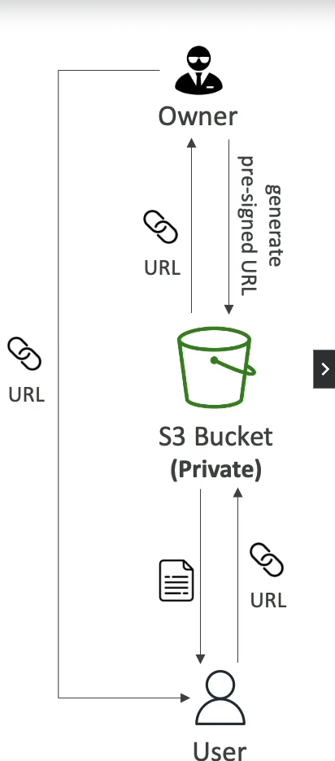

# Generating Pre-signed URLs in Amazon S3

Pre-signed URLs in Amazon S3 provide a way to grant temporary access to your S3 objects without needing to alter your bucket policies or IAM roles. These URLs can be generated using the S3 Console, AWS CLI, or AWS SDKs, and they inherit the permissions of the user who generated them. This feature is particularly useful for scenarios where you need to allow temporary access for downloading or uploading files to your S3 bucket.

## URL Expiration Times

- **S3 Console**: When generating a pre-signed URL through the AWS Management Console, you can set the expiration time from 1 minute up to 720 minutes (12 hours).
- **AWS CLI**: Use the `--expires-in` parameter to specify the expiration time in seconds. The default is 3600 seconds (1 hour), with a maximum of 604800 seconds (168 hours or 7 days).
- **AWS SDKs**: Similar to the CLI, when using any of the AWS SDKs, you can specify the expiration time in seconds, adhering to the same limits.

## Use Cases

1. **Exclusive Content Access**: Allow only logged-in users to download a premium video from your S3 bucket. This ensures that only authenticated users can access premium content.
2. **Dynamic Access**: Generate URLs dynamically for an ever-changing list of users. This is useful for applications where user access needs to be frequently updated without changing IAM policies.
3. **Temporary Upload Access**: Allow users to temporarily upload a file to a precise location in your S3 bucket. This is particularly useful for scenarios where users need to submit files or documents through a web application.

