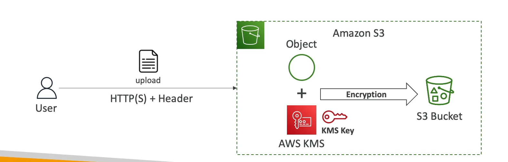

# Server-Side Encryption with KMS Keys (SSE-KMS) in Amazon S3

## Overview
Server-Side Encryption with KMS Keys (SSE-KMS) utilizes AWS Key Management Service (KMS) for managing encryption keys, providing enhanced security features and user control. This method encrypts data server-side before it is stored in S3 buckets.

## Key Features
- **Key Management**: Encryption keys are managed by AWS KMS, offering advanced features such as key rotation, key policies, and detailed audit trails via AWS CloudTrail.
- **User Control**: Users have granular control over encryption keys, including the ability to create, manage, and disable keys.
- **Audit and Compliance**: Integration with AWS CloudTrail allows for auditing of key usage, providing transparency and aiding in compliance efforts.

## How to Use SSE-KMS
To use SSE-KMS for encrypting objects in S3, you must specify the encryption method by setting the `x-amz-server-side-encryption` header to `aws:kms` during the object upload process.

### Example: Enabling SSE-KMS on an Object Upload
To enable SSE-KMS encryption for an object, include the following header in your upload request:

```http
PUT /my-object HTTP/1.1
Host: my-bucket.s3.amazonaws.com
x-amz-server-side-encryption: aws:kms
Content-Length: [length]
Content-Type: text/plain
```

