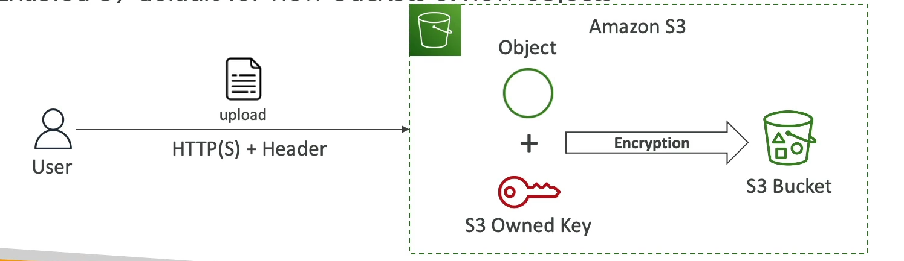

# Server-Side Encryption with S3-Managed Keys (SSE-S3)

## Overview
Server-Side Encryption with S3-Managed Keys (SSE-S3) provides a way to secure your data at rest in Amazon S3. This encryption method uses advanced encryption standard (AES-256) to encrypt S3 objects server-side, which means the data is encrypted as it is written to storage and decrypted when it is accessed.

## Key Features
- **Encryption Handling**: Encryption keys are fully managed, handled, and owned by AWS, removing the complexity of key management from the user.
- **Encryption Type**: Utilizes AES-256, a strong encryption standard, ensuring a high level of security.
- **Automatic Encryption**: Enabled by default for all new buckets and objects, making it an effortless way to secure your data.

## How to Use SSE-S3
When uploading an object, you can specify the use of SSE-S3 by setting the `x-amz-server-side-encryption` header to `AES256`. This instructs Amazon S3 to encrypt the object using SSE-S3 before storing it.

### Example: Enabling SSE-S3 on an Object Upload
To enable SSE-S3 for an object during upload, include the following header in your request:

```http
PUT /my-object HTTP/1.1
Host: my-bucket.s3.amazonaws.com
x-amz-server-side-encryption: AES256
Content-Length: [length]
Content-Type: text/plain
```
