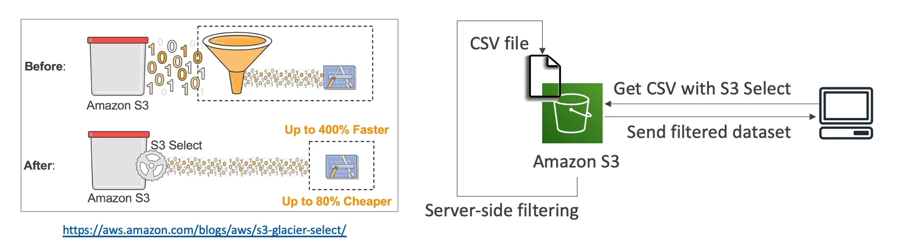

# S3 Select and Glacier Select

Amazon S3 Select and Glacier Select are powerful features that allow you to retrieve only a subset of data from an object by using simple SQL expressions. This means you can perform server-side filtering of data, which has several benefits:

## Key Benefits

- **Efficiency**: By retrieving only the data you need, you reduce the amount of data transferred over the network, leading to faster response times and lower costs.
- **Cost-Effective**: Less data transfer means lower costs for data retrieval, especially important when dealing with large datasets stored in S3 or Glacier.
- **Reduced Load**: Offloading the filtering to AWS reduces the CPU load on your client-side systems, allowing them to perform other tasks more efficiently.

## How It Works

- **SQL Queries**: You can specify simple SQL statements to filter the data by rows and columns. For example, you can select specific fields from a CSV or JSON file stored in S3 or Glacier.
- **Server-Side Filtering**: The filtering is performed directly on the server where the data is stored, before it's sent to the client. This approach is what makes S3 Select and Glacier Select so efficient.

## Use Cases

- **Data Analysis**: Quickly analyze and retrieve insights from large datasets without needing to download the entire dataset.
- **Real-Time Processing**: Fetch and process data in real-time from stored objects for applications like log analysis, data visualization, etc.

By leveraging S3 Select and Glacier Select, you can significantly optimize the way you interact with data stored in Amazon S3 and Glacier, making your applications more efficient and cost-effective.

 
