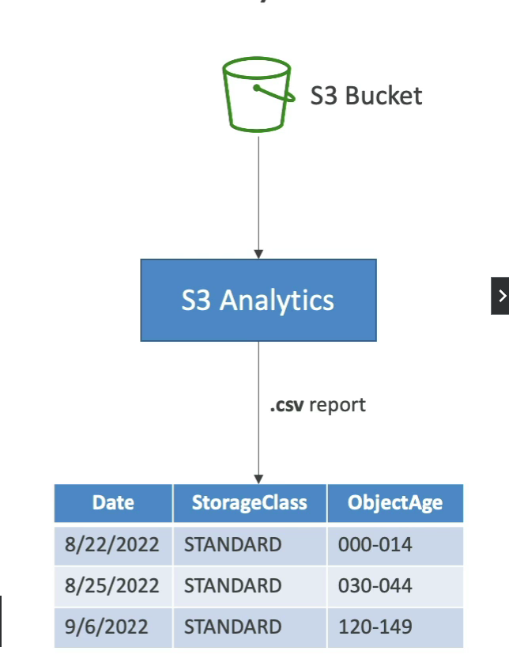

# Storage Class Analysis Guide

Amazon S3's Storage Class Analysis is a tool designed to help you understand your storage access patterns and make informed decisions about transitioning objects to the most cost-effective storage class. This guide focuses on recommendations for transitioning objects to the Standard and Standard-Infrequent Access (IA) storage classes.

## Applicability

- **Target Storage Classes**: Standard, Standard-IA.
- **Non-Applicable**: One Zone-Infrequent Access (IA), Glacier, and Glacier Deep Archive.

## How It Works

1. **Data Collection**: Storage Class Analysis examines access patterns of objects over a period to identify suitable candidates for transition.
2. **Analysis Report**: Generates a report that provides insights into how objects are being accessed within your S3 buckets.
3. **Recommendations**: Based on the analysis, recommendations are made for objects that can be moved to Standard-IA to reduce costs without impacting access latency significantly.

## Key Points

- **Update Frequency**: The analysis report is updated daily, providing fresh insights into your storage usage patterns.
- **Data Analysis Delay**: It may take 24 to 48 hours from the time of setup to start seeing data analysis results. This initial delay is necessary for collecting sufficient data to make accurate recommendations.
- **Lifecycle Rules**: The insights gained from Storage Class Analysis serve as a good first step in setting up Lifecycle Rules. These rules automate the process of transitioning objects between storage classes based on the criteria defined in the analysis report.

## Steps to Enable Storage Class Analysis

1. **Select Bucket**: In the S3 console, choose the bucket for which you want to enable Storage Class Analysis.
2. **Enable Analysis**: Navigate to the Management tab, find the Analytics section, and create a new analysis configuration.
3. **Specify Filters**: If desired, specify filters to analyze only a subset of objects based on prefixes or tags.
4. **Review and Save**: Review your configuration and save it. The analysis will start automatically.

By following these recommendations and utilizing Storage Class Analysis, you can optimize your storage costs and efficiency by ensuring that objects are stored in the most appropriate class based on how frequently they are accessed.

