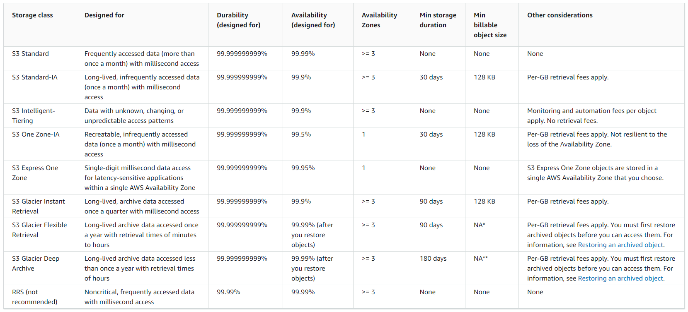

# S3 Storage Classes Overview

Amazon S3 offers a range of storage classes designed for different use cases ranging from frequently accessed data to long-term archiving. Here's a breakdown of the available storage classes:

## Standard

- **Use Case**: General purpose storage for frequently accessed data.
- **Availability**: 99.99%
- **Features**: High durability and availability.

## Standard-Infrequent Access (IA)

- **Use Case**: Ideal for data that is less frequently accessed but requires rapid access when needed, such as disaster recovery and backups.
- **Cost**: Lower than S3 Standard.
- **Availability**: 99.99%

## One Zone-Infrequent Access

- **Use Case**: Suitable for storing secondary backup copies of on-premises data, or data that can be recreated. Not recommended for critical data, as data is lost if the AZ is destroyed.
- **Durability**: 99.999999999% in a single Availability Zone (AZ).
- **Availability**: 99.5%

## Glacier Instant Retrieval

- **Use Case**: Great for data that is accessed less frequently, but requires millisecond retrieval times, such as data accessed once a quarter.
- **Cost**: Includes storage price plus object retrieval cost.
- **Minimum Storage Duration**: 90 days.

## Glacier Flexible Retrieval

- **Use Case**: Offers expedited (1 to 5 minutes), standard (3 to 5 hours), and bulk (5-12 hours) retrieval options at no extra cost, suitable for a variety of access needs.
- **Minimum Storage Duration**: 90 days.

## Glacier Deep Archive

- **Use Case**: For long-term storage of data that is rarely accessed.
- **Retrieval Times**: Standard (12 hours), bulk (48 hours).
- **Minimum Storage Duration**: 180 days.

## Intelligent Tiering

- **Use Case**: Automatically moves objects between tiers based on usage patterns, ideal for data with unknown or changing access patterns.
- **Cost**: Small monthly monitoring and auto-tiering fee. No retrieval charges.
- **Tiers**: Includes Frequent Access, Infrequent Access, Archive Instant Access, Archive Access, and Deep Archive Access tiers, with automatic movement based on object access patterns.

Objects can be moved between these classes manually or using S3 lifecycle configurations to optimize costs and access times based on your specific needs.

