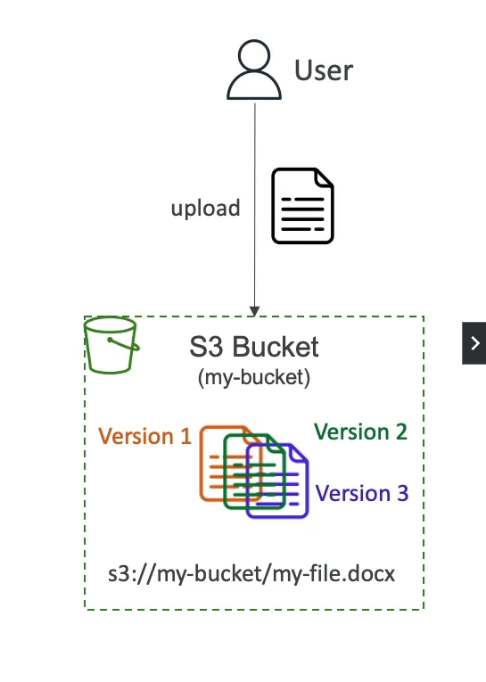

## S3 Versioning Overview

Versioning in Amazon S3 is a powerful feature that allows you to keep multiple versions of an object within the same bucket. This capability is particularly useful for preserving, retrieving, and restoring every version of every object stored in your buckets. Here's how it works and why it's beneficial:

### Enabling Versioning

- **Bucket-Level Setting**: Versioning is enabled at the bucket level. Once turned on, it applies to all objects within the bucket.
- **Version Tracking**: After enabling, every time an object is overwritten or deleted, S3 generates a unique version ID for the object's new version. This includes:
    - **Overwrite Operations**: When an object is overwritten, S3 retains the previous version(s) of the object, each with its own version ID.
    - **Delete Operations**: When an object is deleted, S3 does not actually delete the object but instead marks it with a delete marker. The object's previous versions remain accessible.

### Best Practices and Benefits

- **Protection Against Unintended Deletes**: Versioning provides a safeguard against accidental deletion of objects. You can easily restore a previous version of an object.
- **Facilitates Easy Rollback**: If an object is updated and you need to revert to a previous version, versioning makes this process straightforward.

### Important Notes

- **Initial State**: Objects that were in the bucket before versioning was enabled will have a version ID of `null`.
- **Suspending Versioning**: If you suspend versioning on a bucket, S3 stops assigning version IDs for new objects. However, previously stored versions of objects are retained and remain accessible.

Enabling versioning on your S3 buckets is considered a best practice for data management, providing a robust mechanism for data recovery and protection.

