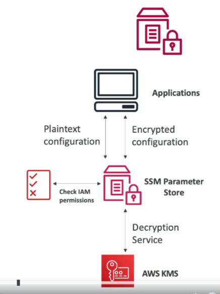

# SSM Parameter Store

## Overview

- **Secure Storage**: Secure storage for configuration and secrets.
- **Optional Encryption**: Seamless encryption using KMS.
- **Serverless**: Scalable, durable, and easy to use with SDK.

## Features

- **Version Tracking**: Version tracking of configurations and secrets.
- **Security**: Security through IAM.
- **Notifications**: Integration with Amazon EventBridge for notifications.
- **CloudFormation Integration**: Integration with CloudFormation.
- **TTL**: Allow to assign a Time-to-Live to a parameter to force updating or deleting sensitive data such as passwords.

