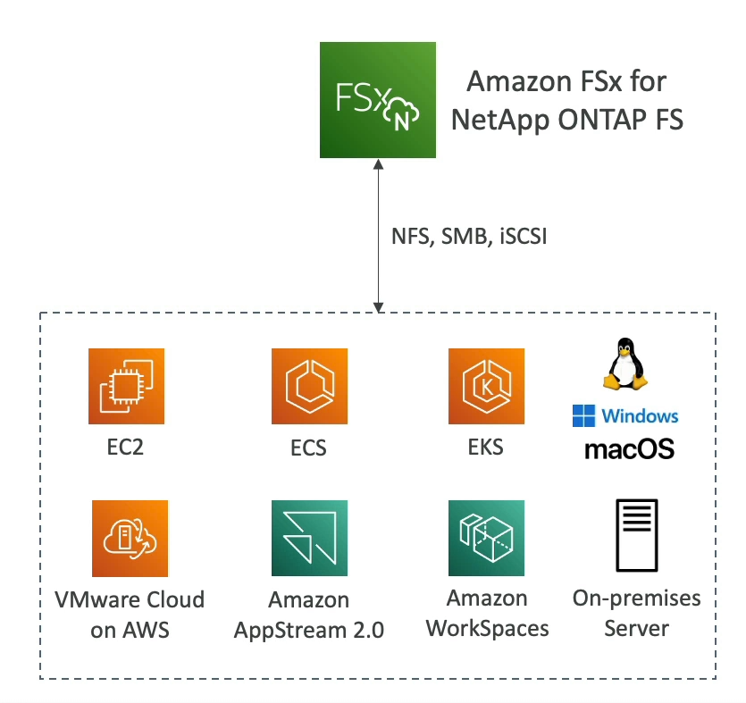

# FSx for NetApp ONTAP

Amazon FSx for NetApp ONTAP offers a fully managed NetApp ONTAP file system on AWS, providing a robust set of features that are ideal for running enterprise workloads with the flexibility and cost-efficiency of the cloud.

## Key Features

- **Protocol Support**: Compatible with NFS, SMB, and iSCSI protocols, ensuring broad application compatibility and seamless integration with existing environments.

- **Workload Migration**: Simplifies the migration of workloads running on ONTAP or NAS systems to AWS, enabling organizations to leverage cloud scalability and flexibility.

- **Automatic Storage Scaling**: Storage capacity automatically adjusts, shrinking or growing based on demand, ensuring efficient use of resources and cost savings.

- **Data Management**: Includes advanced features such as snapshots for point-in-time recovery, replication for data protection, and storage efficiency features like compression and data de-duplication to reduce storage costs.

- **Instantaneous Cloning**: Point-in-time instantaneous cloning is available, which is particularly useful for testing new workloads or environments without affecting production data.

By utilizing FSx for NetApp ONTAP, businesses can achieve high performance and reliability for their critical applications, while benefiting from the operational simplicity and cost-effectiveness of AWS.

