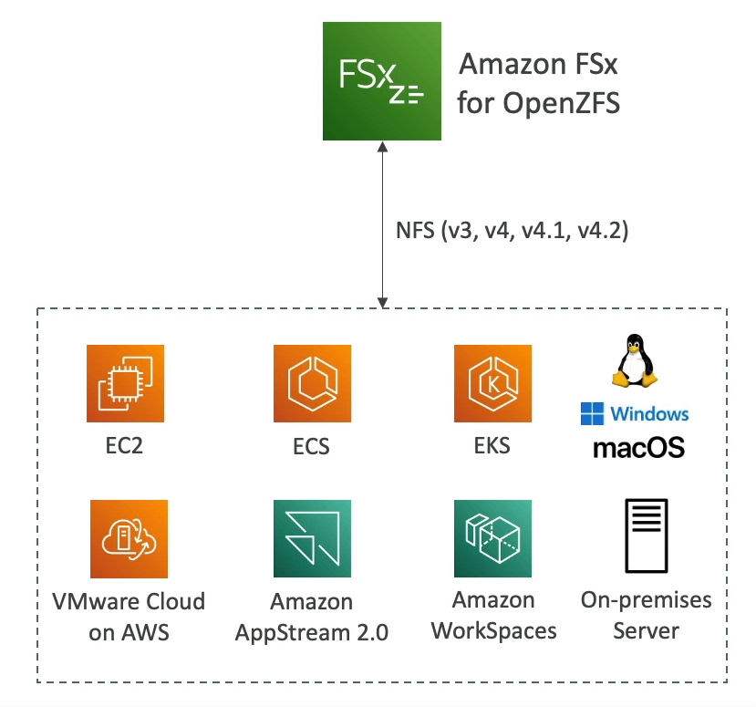

# FSx for OpenZFS

Amazon FSx for OpenZFS offers a fully managed OpenZFS file system on AWS, providing a high-performance and feature-rich storage solution.

## Key Features

- **NFS Compatibility**: Ensures seamless integration with existing environments by supporting the Network File System (NFS) protocol.

- **Workload Migration**: Facilitates easy migration of workloads running on ZFS to AWS, enabling users to leverage the scalability and flexibility of cloud infrastructure.

- **High Performance**: Capable of delivering up to 1,000,000 IOPS with sub-millisecond (< 0.5ms) latency, suitable for performance-intensive applications.

- **Data Management**: Features advanced data management capabilities such as snapshots for efficient point-in-time recovery, compression to reduce storage costs, and low-cost storage options.

- **Instantaneous Cloning**: Offers point-in-time instantaneous cloning, which is invaluable for testing new workloads or environments without impacting production data.

Leveraging FSx for OpenZFS on AWS allows businesses to combine the benefits of OpenZFS with the scalability, reliability, and security of AWS.

