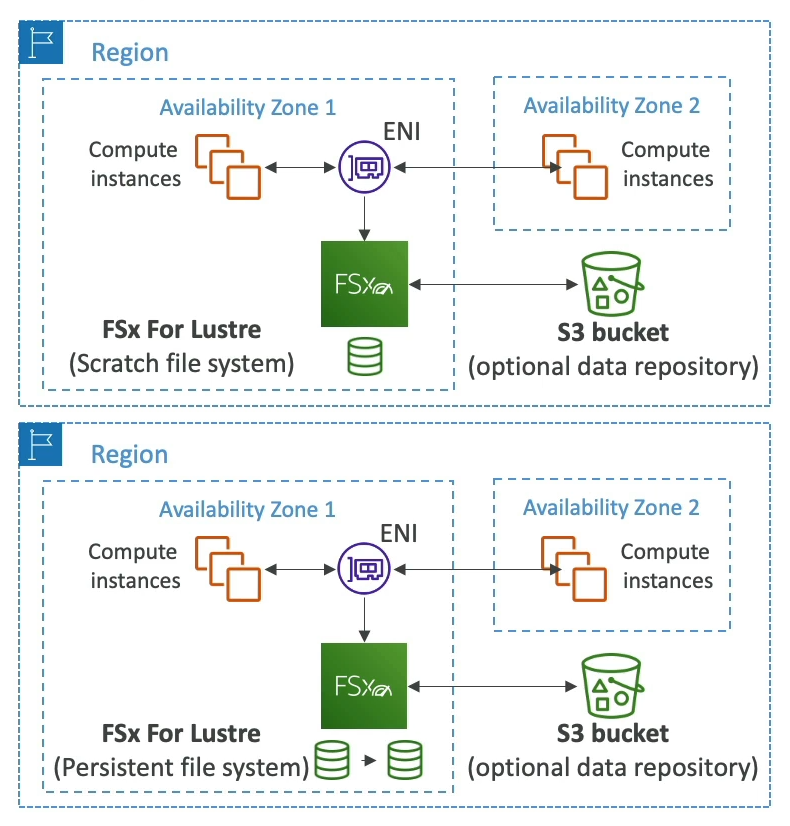

# FSx File System Deployment Options

Amazon FSx offers different deployment options tailored to specific storage needs and workloads. These include the Scratch and Persistent file systems, each designed for different use cases.

## Scratch File System

- **Temporary Storage**: Designed for temporary storage needs, where data persistence is not a primary concern.
- **No Data Replication**: Data stored in a Scratch file system is not replicated. If the file server fails, the data does not persist.
- **High Burst Capability**: Offers a high burst throughput, up to 6 times faster, with 200MBps per TiB of storage.
- **Usage**: Ideal for short-term processing tasks where cost optimization is key.

## Persistent File System

- **Long-term Storage**: Built for long-term storage requirements, ensuring data is kept safe over extended periods.
- **Data Replication**: Data is replicated within the same Availability Zone (AZ), enhancing data durability.
- **Rapid File Replacement**: Can replace failed files within minutes, minimizing downtime.
- **Usage**: Suitable for long-term processing and storage of sensitive data that requires high availability and durability.

