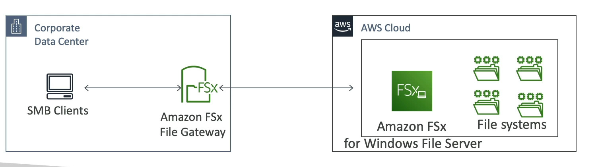

# FSx File Gateway

Amazon FSx File Gateway offers native access to Amazon FSx for Windows File Server, providing a seamless bridge between on-premises environments and AWS cloud storage services.

## Key Features

- **Native Access**: Enables native access to Amazon FSx for Windows File Server, allowing applications and users to interact with cloud storage as if it were a local file system.

- **Local Cache**: Maintains a local cache of frequently accessed data, ensuring high performance and low latency access to critical files.

- **Windows Native Compatibility**: Fully supports Windows native features such as SMB protocol, NTFS file system, and integration with Active Directory. This ensures seamless integration into existing Windows-based environments.

- **Use Cases**: Particularly useful for managing group file shares and home directories, providing a cloud-backed storage solution that is transparent to the end-user.

By leveraging FSx File Gateway, organizations can extend their on-premises file storage to the cloud, benefiting from the scalability, reliability, and security of AWS, while maintaining a familiar Windows file system environment.

