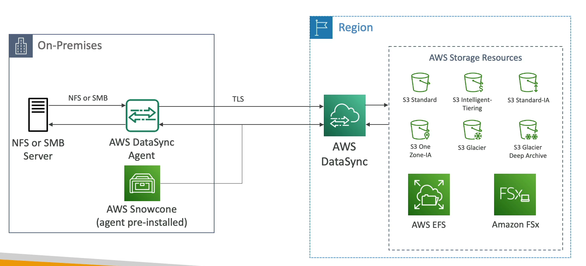
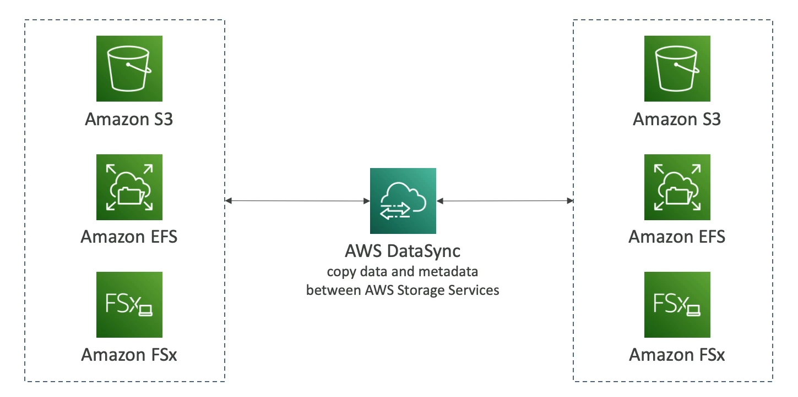

# DataSync

Amazon DataSync is a data transfer service designed to simplify and accelerate moving large amounts of data between on-premises storage systems, other cloud storage services, and AWS storage services.

## Key Features

- **Versatile Data Transfer**: Supports transferring data to and from on-premises or other cloud storage systems to AWS using various protocols such as NFS, SMB, HDFS, and S3 API. An agent is required for these operations.

- **AWS to AWS Transfers**: Facilitates data movement between different AWS storage services without the need for an agent.

- **Supported AWS Storage Services**: Data can be synchronized to various AWS storage services, including:
    - Amazon S3 (supports all storage classes, including Glacier)
    - Amazon EFS
    - Amazon FSx (supports Windows File Server, Lustre, NetApp, and OpenZFS)

- **Scheduling**: Replication tasks can be scheduled to run hourly, daily, or weekly, according to your needs.

- **Data Integrity**: Ensures file permissions and metadata are preserved across transfers, supporting NFS POSIX, SMB, and other protocols.

- **Performance**: A single agent task can utilize up to 10G of bandwidth. Additionally, users can set up bandwidth limits to manage network usage.

By leveraging Amazon DataSync, organizations can efficiently manage data migration and synchronization tasks, ensuring data is where it needs to be, when it's needed, while maintaining data integrity and optimizing network usage.

