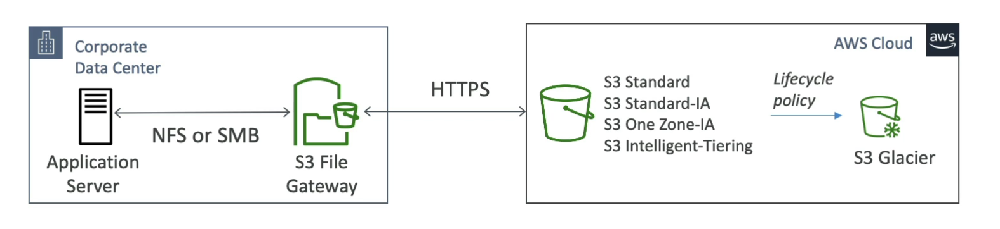

# S3 File Gateway

Amazon S3 File Gateway provides a seamless way to connect on-premises applications with Amazon S3 storage, allowing S3 buckets to be accessed as if they were local file shares.

## Key Features

- **Protocol Support**: Configured S3 buckets can be accessed using both NFS and SMB protocols, ensuring compatibility with a wide range of applications and operating systems.

- **Data Caching**: The most recently used data is cached in the file gateway, providing faster access to frequently accessed files.

- **S3 Storage Classes Support**: Supports various S3 storage classes including S3 Standard, S3 Standard-IA (Infrequent Access), S3 One Zone-IA, and S3 Intelligent-Tiering, allowing for cost-effective storage management.

- **Lifecycle Policy Integration**: Enables the transition of data to S3 Glacier for archival purposes using S3 Lifecycle policies, optimizing storage costs over time.

- **IAM Roles for Bucket Access**: Bucket access is managed using IAM roles for each File Gateway, enhancing security and providing fine-grained access control.

- **Active Directory Integration for SMB**: The SMB protocol feature integrates with Active Directory (AD) for user authentication, simplifying the management of user access to the file gateway.

By leveraging S3 File Gateway, organizations can easily integrate cloud storage into their existing file-based applications and workflows, benefiting from the scalability, durability, and cost-efficiency of AWS S3.

