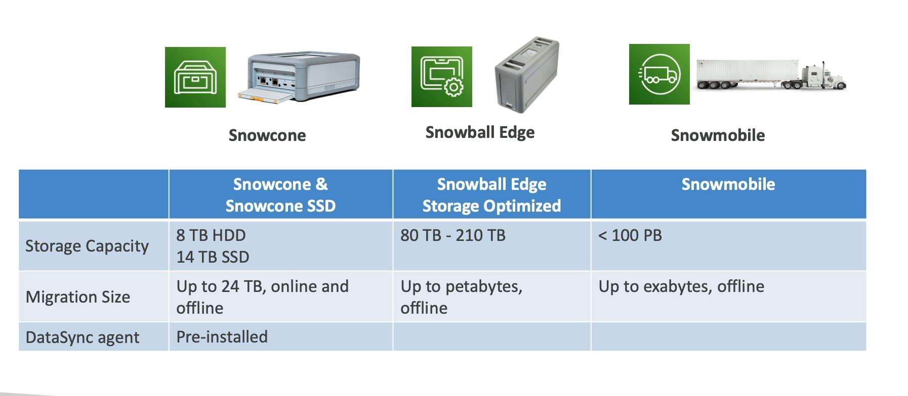

# Snow Family

AWS Snow Family consists of highly-secure, portable devices designed to collect, process, and migrate data at the edge, facilitating the transfer of large amounts of data into and out of AWS with ease, even in environments with limited connectivity or bandwidth.

## Data Migration

The Snow Family offers several devices tailored for different scales of data migration:

- **[Snowcone](./snowcone.md)**: A small, portable device for edge computing and data transfer.
- **[Snowball Edge](./snowball-edge.md)**: A more capable device with onboard storage and computing capabilities, suitable for larger data transfer and edge computing tasks.
- **[Snowmobile](./snowmobile.md)**: An exabyte-scale data transfer service, used for moving extremely large amounts of data to AWS.

## Edge Computing

- **Snowcone**: Specifically designed for edge computing tasks in addition to data transfer, enabling processing at the edge before migrating data to AWS.

## Challenges Addressed

- **Limited Connectivity and Bandwidth**: Snow Family devices are ideal for environments where internet connectivity is unreliable or bandwidth is too limited for efficient data transfer.
- **High Network Costs and Shared Bandwidth**: Utilizing Snow Family devices for data migration can significantly reduce network costs and mitigate issues related to shared bandwidth constraints.
- **Connection Stability**: By allowing for offline data transfer, Snow Family devices eliminate the dependency on stable internet connections.

## When to Use Snow Family Devices

- **Offline Data Migrations**: The Snow Family is particularly beneficial for offline data migrations, providing a robust solution when transferring data over the network is impractical due to size, speed, or connectivity limitations.
  - **Large-Scale Migrations**: If it takes more than a week to transfer data over the network, Snowball devices offer an efficient and cost-effective alternative.

