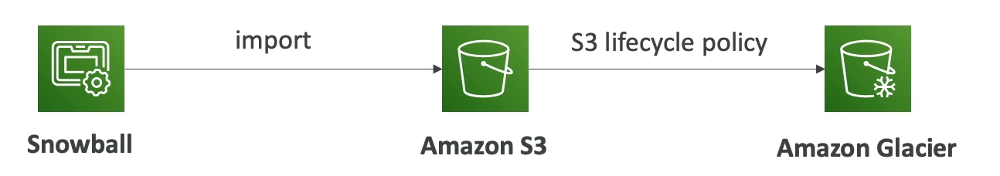

# Solution Architecture: Snowball into Glacier

Transferring data from AWS Snowball to Amazon Glacier requires an intermediary step through Amazon S3, as Snowball does not support direct data transfer to Glacier. The process involves transferring data from Snowball to S3 and then applying an S3 lifecycle policy to move the data to Glacier for long-term storage.

## Step-by-Step Process

1. **Data Transfer to S3**: Initially, data is transferred from Snowball to an Amazon S3 bucket. This is done by connecting the Snowball device to your network and using the AWS Snowball client to copy data to the device. Once the device is shipped back and received by AWS, the data is transferred to the specified S3 bucket.

2. **Setting Up S3 Lifecycle Policy**: After the data is in S3, set up a lifecycle policy on the S3 bucket. This policy automates the transition of data from S3 to Glacier for cost-effective long-term storage. The policy can specify conditions such as the age of the data before it's moved to Glacier.

3. **Data Archiving to Glacier**: Based on the lifecycle policy, data is automatically moved from S3 to Glacier. This transition is managed by AWS without any need for manual intervention, ensuring that data is archived in Glacier according to the defined rules.

## Considerations

- **Cost**: While transferring data to Glacier is cost-effective for long-term storage, be aware of retrieval costs and times, which can vary based on the retrieval option chosen in Glacier.

- **Data Retrieval**: Plan for the time it takes to retrieve data from Glacier, which can range from a few minutes to several hours.

- **Lifecycle Policy Configuration**: Carefully configure the lifecycle policy to match your data retention and access requirements, ensuring that data is moved to Glacier only when it meets the specified criteria.

By following this architecture, organizations can efficiently leverage Snowball for large-scale data transfers and Glacier for secure, long-term storage, optimizing costs and ensuring data durability.

 
