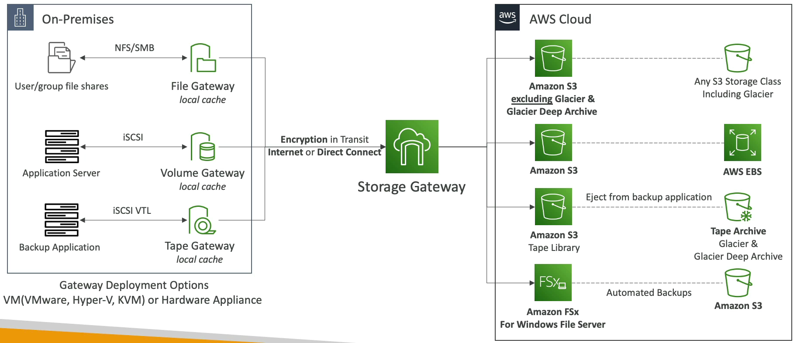

# Storage Gateway

Amazon Storage Gateway is a hybrid cloud storage service that gives you on-premises access to virtually unlimited cloud storage. The service provides three types of gateways – File Gateway, Volume Gateway, and Tape Gateway – each of which offers different features and use cases to integrate AWS cloud storage with existing on-premises environments.

## Key Features

- **File Gateway**: Allows you to store and retrieve objects in Amazon S3 using file protocols such as NFS and SMB. Ideal for integrating existing file-based applications or devices with cloud storage.

- **Volume Gateway**: Provides block storage to your applications using the iSCSI protocol. It comes in two modes: Stored Volumes, where your primary data is stored on-premises and asynchronously backed up to S3, and Cached Volumes, where your primary data is stored in S3 and your most frequently accessed data is cached on-premises.

- **Tape Gateway**: Offers a durable, cost-effective solution to archive your data in the AWS Cloud. The Tape Gateway emulates a physical tape library and provides a virtual tape infrastructure that scales seamlessly with your business needs.

## Benefits

- **Hybrid Cloud Storage**: Seamlessly integrates your on-premises IT environment with the AWS Cloud.

- **Cost-Effective**: Reduces the cost of storage by leveraging the AWS Cloud, offering various storage classes to optimize costs.

- **Scalable and Secure**: Easily scales your storage up or down with secure data transfer to and from AWS.

- **Data Backup and Archiving**: Simplifies data backup and archiving processes, ensuring data durability and business continuity.

By utilizing Amazon Storage Gateway, businesses can bridge their on-premises storage systems with the cloud, enabling more flexible and cost-effective storage solutions.

